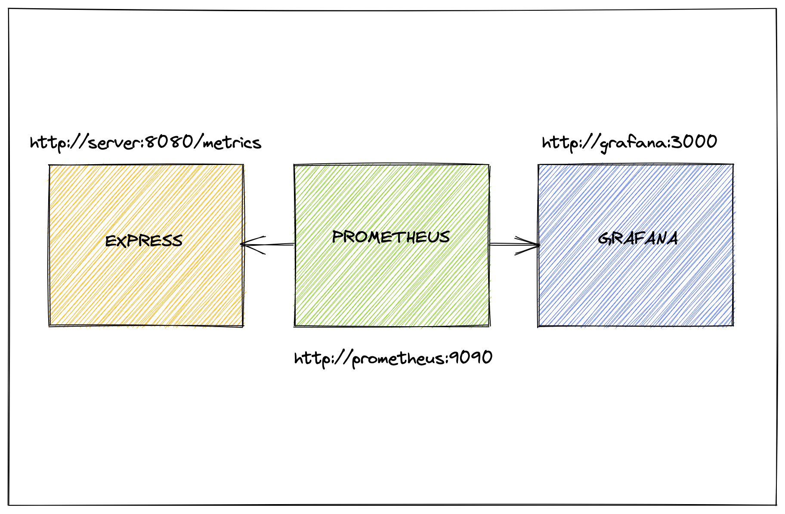

# Monitorization: Express + Prometheus + Grafana



## Install dependencies

```bash
yarn
```

## Docker componse

```bash
docker-compose build
docker-compose up
```

## [Visit metrics](http://localhost:8080/metrics)

## [Visit Prometheus](http://localhost:9090)

## [Visit Grafana](http://localhost:3000)
